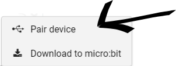
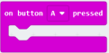
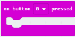
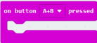
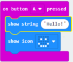
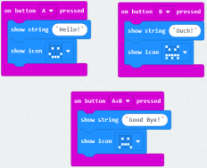
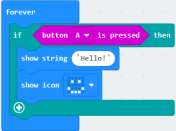
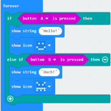

# Using the Buttons

## Overview

Within this tutorial we are going to show you two different ways that you can use the buttons on the micro:bit using the MakeCode editor.

## Getting Started

1. Open your favourite web browser (we recommend Google Chrome).

2. Type [makecode.microbit.org](https://makecode.microbit.org/#) into the address bar of your web browser.

3. Click on New Project and give it a meaningful name and click on create.

## Setting up WebUSB

1. Click on the 3 dots next to Download.

2. Click on Pair device.

3. Pick your micro:bit from the list of devices and click on Connect.

## Code Blocks

The code blocks we will use are;

1. **On button A pressed**

 - Will run the code when button A is pressed

2. **On button B pressed**

 - Will run the code when button B is pressed

3. **On button A+B pressed**

 - Will run the code when buttons A and B are pressed

4. **is button A pressed**

 - This will check to see if button a has been pressed then run the code

5. **is button B pressed**

 - This will check to see if button b has been pressed then run the code

### on button A pressed

1. Click and drag the on start and forever blocks to the left of the screen and drop them in the bin.

2. Click on Input. Click and drag a on button A pressed block to the code area and drop it.

3. Click on Basic. Click and drag a show string block to the code area and attach it inside on button A is pressed.

4. Click on Basic. Click and drag a show icon block to the code area and attach it under the show string block.

5. Click on the little white arrow next to the heart icon and pick the happy face.

6. Click on Download to download and run your code on your micro:bit.

Your code should look like this:

## on button B pressed

1. Right click on button A pressed and click on duplicate.

2. Click on the little arrow next to A and click on B.

3. Click on the show string block where is says "Hello!" and type ouch!

4. Click on the little arrow next to the happy face and click on the angry face.

5. Click on Download to download and run your code on your micro:bit.

Your code should look like this:

## on button A+B pressed

1. Right Click on button B pressed and click on duplicate.

2. On the Greyed out block click on the small arrow next to be and click on A+B.

3. Click on "ouch!" and type good bye!

4. Click on the small arrow next to the angry face and pick the sad face.

5. Click on Download to download and run your code on your micro:bit.

Your code should look like this:

## button A is pressed

1. Create a new project and give it a meaningful name then click create.

2. Click and drag the on start block to the left of the screen and drop it in the bin.

3. Click on Logic. Click and drag a if true then block to the code area and attach it within the forever block.

4. Click on Input. Click and drag a button A is pressed block to the code area and attach it within the true of the if then block.

5. Click on Basic. Click and drag a show string block to the code area and attach it within the if button a is pressed block.

6. Click on Basic. Click and drag a show icon block to the code area and attach it under the show string block.

7. Click on the small arrow next to the heart and pick the happy face.

8. Click on Download to download and run your code on your micro:bit.

Your Code should look like this:

## button B is pressed

1. Click on the + sign at the bottom of the if then block. Click on the + sign again.

2. Click on Input. Click and drag a button A is pressed block to the code area and attach it within the blank space of the else if then block.

3. Click on the little arrow next to A and click on B.

4. Click on Basic. Click and drag a show string block to the code area and attach it within the else if button B is pressed block.

5. Click on "Hello!" and type ouch.

6. Click on Basic. Click and drag a show icon block to the code area and attach it under the show string block. Click on the small arrow next to the heart and pick the angry face.

7. Click on Download to download and run your code on your micro:bit.

Your Code should look like this:

> ## Challenge
>
> You have now learned how to use the buttons as input on the micro:bit. Why not try and create your own program using the LED matrix and buttons
