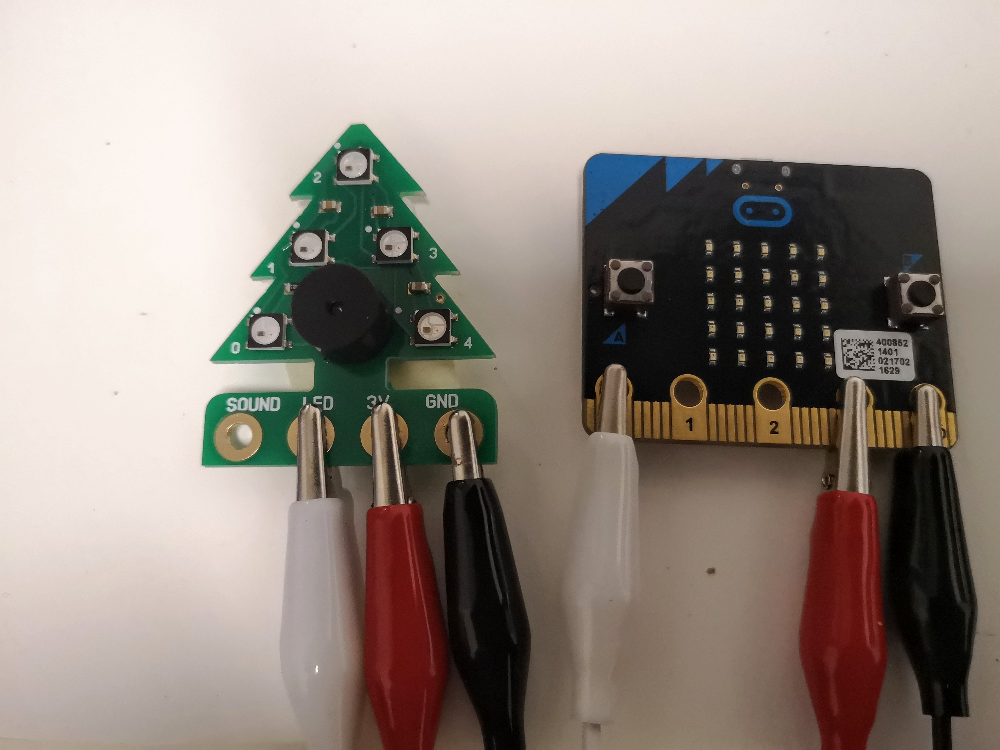
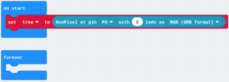
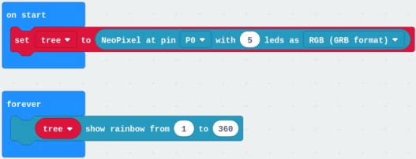

# Code A Christmas Tree

This is a tutorial to code a micro:bit Christmas Tree from PocketMoneyTronic.

## What You Will Need

* 1 x micro:bit
* 1 x micro USB cable
* 1 x PocketMoneyTronic Christmas Tree
* 3 x Crocodile / Alligator Clips
* MakeCode Coding editor

## Connecting The Christmas Tree To The micro:bit

Using the three crocodile/alligator clips we need to connect the Christmas tree to the micro:bit.

1. Take one crocodile/alligator clip and attach it to the circle marked **LED** on the Christmas tree. Take the other end of the crocodile/alligator clip and attach it to the circle marked **0** on the micro:bit.
2. Take another crocodile/alligator clip and attach it to where it says **3v** on the Christmas tree. Take the other end of the crocodile/alligator clip and attach it to **3v** on the micro:bit
3. Take the last crocodile/alligator clip and attach it to **GND** on the Christmas tree. Take the other end of the crocodile/alligator clip and attach it to **GND** on the micro:bit.

Once all the wires are connected between the micro:bit and Christmas tree it should look something like this:

## Coding The Christmas Tree

To code your Christmas tree we first need to open the MakeCode editor. You can do this by typing www.makecode.microbit.org

### Importing The Neopixel Extension

1. Click on Advanced.
2. Click on Extensions
3. click on **neopixel**

### Setting Up The Neopixels

1. Click on **Variables**
2. Click on **Make a Variable...**
3. Type **tree** and press enter
4. Click on **Neopixel**
5. Click and drag a **set strip to NeoPixel at pin P0 with 24 leds as RGB (RGBformat)** to the coding area and attach it within the **on start** Code block.
6. Click on the arrow next to **strip** and click on **tree**
7. Click on **24** and type **5**. This is how many neopixels are on the Christmas Tree.

Your Code should now look like this:

We now have the Neopixels configured in MakeCode. We can now code our Christmas tree!

### Lighting Up Our Tree

1. Click on Neopixel
2. Click and drag a **strip show rainbow from 1 to 360** to the coding area and attach it within the **forever** block
3. Click on the small arrow next to **strip** and click on **tree**

Your code should now look like this:

## Downloading your code to the micro:bit

1. Click on **Download** and save your code file in the downloads folder
2. Navigate to the Downloads folder on your computer
3. Copy your code file
4. Click on **MICROBIT** in the file manager and paste your cod file.

You will now see the light on the back of your micro:bit. Once this has finished. you should see your Christmas tree light up.
