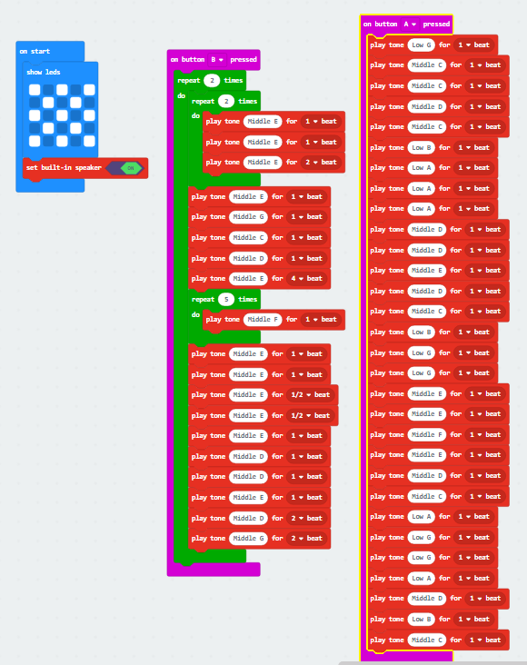
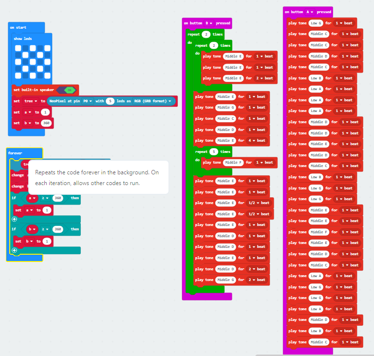

# 2020 Roundup

### What a year we have all had!

Here at RaspiKidd it's been a real rollercoaster. Started in January with running a 2-day robotics workshop within the V&A Dundee to then supporting a group of high school children develop their idea within the school's design jam again within the V&A Dundee. At this point, I was also in talks with various people and organisations on running more activities throughout the year. Well, low and behold the world as we knew it then changed in March with the whole world pretty much going into lockdown due to Covid19 no more face to face meetings or workshops.

At this point, I had the idea of brushing up on my digital skills and start releasing video content to go along with the written tutorials as well as fleshing out the website a little. I decided to embrace the free time that I had, but low and behold this opened up a huge range of new activities to take part in from Preston Raspberry Jam to business development courses with WBS and not forgetting the amount of online networking that popped up. Within little to no time, I found myself digitally jetting up and down the country to different events. My free time then dissolved even more where I got called back to my part-time job within only 4 weeks, but instead of only going back part-time this turned into fulltime for a while until I decided enough was enough and cut my hours back down again as the development of RaspiKidd and micro:mag started to suffer and so was my mental status as I was no longer doing what I loved!

micro:mag also took on a new direction this year by us doing away with physical and digital magazines and moving to a news website which allowed us to release content more frequently and report on a couple of big micro:bit events as they happened;

1. **Release of micro:bit v2** For this to happen we had to sign an NDA a month before release this allowed us to get some inside info and early access to the v2 micro:bit so we could do a detailed hands-on article about the new features that it had in store and give our thoughts to why people should go out and buy one. Read more here https://micromag.cc/microbit-v2-announcement/

2. **micro:bit Live** The micro:bit conference was held online this year spreading across 2 days. The team at micro:mag decided we would live blog the event, so over the 2 days the event ran for a total of 6 hours with us putting out 70 posts about the sessions we attended. You can read the full blog here https://micromag.cc/micro-bit-live-2020-live-blog/

## Fast forwarding a few months

I got approached by a fellow code club volunteer who wanted to apply for a funding grant to run robotics workshops (DundeeBots) within the deprived areas of Dundee and he wanted RaspiKidd to coordinate and run these sessions in 2021. So I jumped at the chance.

I have also copy-edited and play tested my way through Python learning resources for Minecraft Educational Edition on behalf of Causeway Digital Find out more here https://causewaydigital.io/. For someone that has never played Minecraft in my life, I enjoyed doing this and can't wait to do more if the opportunity arises.

## Fast forwarding a little again

I have now started to release some video tutorials on YouTube available at https://www.youtube.com/channel/UC0IHxEDaC6z9py2XAGaTYPA these accompany the written tutorials within the website.

The funding grant I talked about above we have been successful and will be creating robotics kits and learning resources to go into Dundee schools and teach kids how to build and code the robots under DundeeBots(website coming soon) where everything will be documented for other teachers and code club volunteers etc to use and remix. As I am writing this I have just been informed that all the paperwork is in order and it's getting forwarded on to the relevant departments to countersign. 2021 is already looking to be a good year for RaspiKidd. More on that later...

For now, I want to leave you with some code and a short video of it in action to finish 2020 in style. This is my first of many posts using the micro: bit v2.

## Merry Christmas

Here is a bit of Christmas fun for the people that own a micro:bit v2 or get one for Christmas.

### Code

This will play well known Christmas songs when either button A or button B is pressed.

Or like me, you have a PocketMoneyTron Christmas tree you can attach that to the micro:bit and have your very own flashing Christmas tree and carolling micro:bit.

Full project can be found here: https://makecode.microbit.org/_X3xRsK0ozKzf

See the video of it in action here: https://youtu.be/zBd4tbGK5yg

## Coming in 2021

* Well one thing we know for certain I will be running workshops building and coding robots. (no idea how this will work digitally if it comes to that)

* There will be more tutorials and video content getting posted here more regularly

One final note there are other things in the pipelines for 2021 too. there is the possibility of more workshops funding permitted.

Even if this does not go to plan one major thing I want to change next year is working fulltime within RaspiKidd and giving up part-time work. If there is anything 2020 has taught me it's I no longer want to work for someone else and I want to do what I love full time. Part of this may not be the educational stuff I have grown to love but going back to my roots of Software development. Another major thing I would like to work towards next year is getting my own office/mini makerspace so I can prototype and design new kits and tutorials easily.

That's all from me this year.

### Stay Safe and enjoy the holidays as much as you can through these crazy times!
