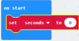
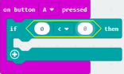
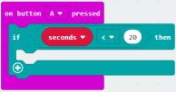
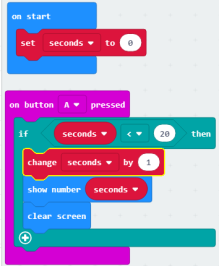
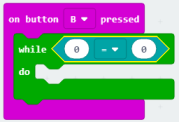
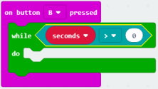
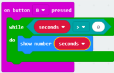
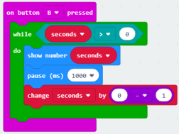
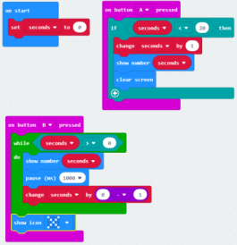

# Countdown Timer

## Introduction

Within this tutorial we are going to create a countdown timer using a micro:bit and the MakeCode editor.

## Getting Started

### You Will Need

1 x micro:bit
* 1 x micro USB cable
* 1 x computer with internet connection

Open Google Chrome on your computer by clicking this icon 

Once Chrome has opened type: [makecode.microbit.org](https://makecode.microbit.org/) into the search bar and press enter and click on new preoject once the pages has loaded.

#### Let's Get Coding!

## Code

Click and drag the forever block to the left until you see a bin icon. Now drop it, this has deleted that block as we don't need it.

### Create a variable

1. Click on **Variables**.

2. Click on **Make a Variable**.

3. Type "**seconds**" into the text box and click Ok.

### Setting seconds to 0 on start

Click and drag a **set seconds to 0** block to within the **on start** block. Your code should now look like this:

### Increasing the timer by 1 when button A is pressed

1. Click on **Input**.

2. Click and drag an **on button A pressed** block to the coding area.

3. Click on **Logic**.

4. Click and drag an **if true then** block into the coding area and attach within **on button A pressed**.

5. Click on **Logic**.

6. Click and drag a **0 < 0** block and drop it where it says **true** within the **if then** code block. Your code should now look like this:

7. Click on **Variables**.

8. Click and drag a **seconds** block and attach it within the first 0 of the **if then** code block.
9.  Where the second 0 is type 20. Your code should now look like this:

10. Click on **Variables**.

11. Click and drag a **change seconds by 1** block to the coding area and attach it within the **if then** block.
12. Click on **Basic**.

13. Click and drag a **show number** and attach it under the **change seconds by** block.
14. Click on **Variables**.

15. Click and drag a **seconds** block and attach it into the 0 of the **show number** block.
16. Click on **Basic**.

17. Click on **more**.

18. Click and drag a **clear screen** block and attach it under the **show number** block. Your code should now look like this:

### Start the timer when B is pressed

1. Click on **Input**.

2. Click and drag an **on button A pressed** and drag it to the coding area.
3. Click on the small arrow next to "**A**" and click on **B**.

4. Click on **Loops**.

5. Click and drag a **while true do** block on to the coding area and attach it to **on button B pressed**.

6. Click on **Logic**.

7. Click and drag a **0 = 0** block to the code area and attach it to where it says **true** within the **while do** block. Your code should look like this:

8. Click on **Variables**.

9. Click and drag a **seconds** block and attach it to the first **0** in the **while do** block.

10. Click on the small arrow next to the **=** sign and click on the **>** sign. Your code should now look like this:

 

11. Click on **Basic**.

12. Click and drag a **Show nmumber** block to the code area and attach it within the **while do** block.

13. Click on **Variables**.

14. Click and drag the **seconds** block and attach it within the **0** of the **show number** block. Your code should look like this:

15. Click on **Basic**.

16. Click and drag a **pause (ms) 100** block and attach it under show number.

17. Click on the small arrow next to **100** and click on **1 second**.

18. Click on **Variables**.

19. Click and drag a **change seconds by 1** block and attach it under the **pause** block.

20. Click on **Math**.

21. Click and drag a **0 - 0** block to the coding area and attach it within the **1** of the **change seconds by** block. Change the second **0** to 1. Your code should look like this:

 

22. Click on **Basic**.

23. Click and drag a **show icon** block to the code area and attach it under the **while do** block.

24. Click on the little arrow next to the **heart** and click on the **X** image.

#### Well done you have completed the code!

 
 
 
 

## Completed Code

## Testing

Let's grab a micro:bit and test our code. If you don't have a micro:bit use the virtual micro:bit within the MakeCode editor.

## Downloading Your Code

1. Click on the **Download** button.

2. Save your code to the Downloads folder on your computer.

3. Connect the micro:bit to your computer using the micro USB cable.

4. Drag the **.hex** file from the Downloads folder to your micro:bit drive.

## Running The Code

Press button A on your micro:bit to count up to 20 seconds. or anywhere in-between. 

When you are ready to start your timer press button B and watch your micro:bit count down to 0 and display the X.

## Challenges

1. Try to increase your timer to 60 seconds.

2. Look up how long it takes to boil an egg.

3. Try and adapt your code to time a boiling egg.
