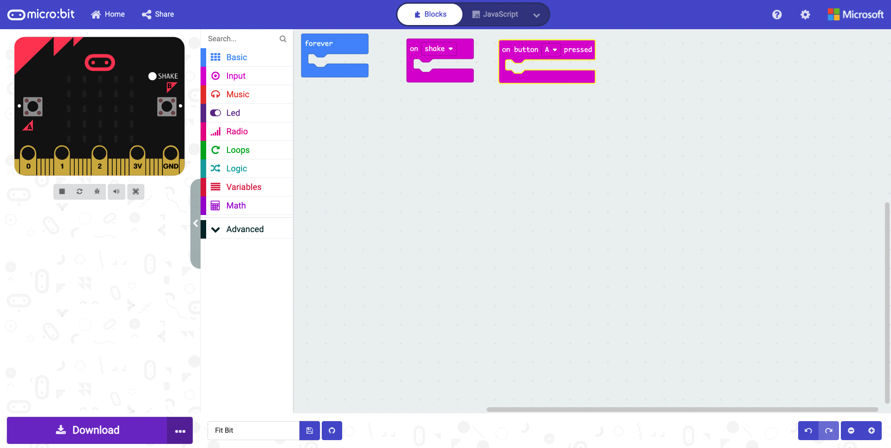
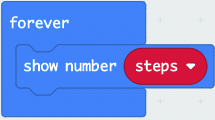
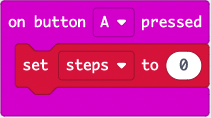
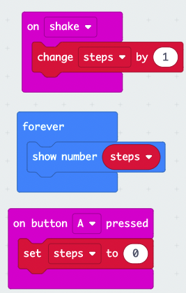

# Create Your Own Fit Bit

We are all familiar with fit bits and other smart watches even our phones counting our steps through the day. Lets use a micro:bit to code our own.

## What You Will Learn

- [ ] Create and use a variable
- [ ] Using the on shake function
- [ ] Using a forever loop
- [ ] How to show a number on the LED matrix
- [ ] How to use the button function

## Setting Up

1. Open your favourite browser (we recommend Google Chrome) or if using a phone or tablet open the micro:bit app.
2. Within the address bar of your browser type [makecode.micro:bit.org](https://makecode.microbit.org/#) or on a phone/tablet press create code.

3. Click on new project and give it the name Fit Bit.

We are now ready to start coding!

## Getting Started

1. Click and drag the on start block to the left of the screen and drop it on the bin.
2. Click on Input. Click and drag a on shake block to the code area and drop it.
3. Click on Input. Click and drag a on button A pressed block to the code area and drop it.

Your screen should look like this:

## Creating a Variable

> **What is a Variable**
> Think of a variable as a box that stores information that can be used throughout our program.
> We give variables a descriptive name so we and others can understand what is going onwithin our program.

1. Click on Variables. Click on make a variable...
2. Type steps and click on OK.

## Change Steps By

Click on Variables. Click and drag a change steps by 1 block to the code area and attach it within the on shake function.

Everytime the micro:bit detects a shake it will increase the variable steps by 1.

Your code will look like this:

## Show Number

1. Click on Basic. Click and drag a show number 0 block to the code area and attach it within the forever block.
2. Click on Variables. Click and drag a steps block to the code area and attach it within the 0 of the show number block.

This will display the number of steps on the LED matrix.

Your code should look like this:

## Set Steps To

Click on Variables. Click and drag a set steps to 0 block to the code area and insert it within the on button A pressed block.

This will reset the step counter back to 0 when button A is pressed.

Your code will look like this:

Completed code:

## Downloading Code

1. Click on the 3 dots next to Download.
2. Click on pair device a pop-up will come on screen to show you how to connect your micro:bit to the computer. Click on pair device again.
3. Click on BBC micro:bit xxxx and click connect.
4. Click on Download.

You have now created your own fit bit step counter.

Strap the micro:bit to your leg and go for a walk and watch your steps add up.
