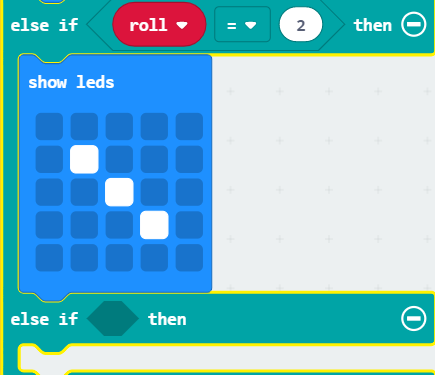

# Code a Dice

Have you lost a dice to your favourite game?
Why not code yourself a new one!

Within this tutorial you will be shown how to code a dice.

## What you will need

* 1 x micro:bit
* 1 x micro USB cable
* 1 x Battery pack (optional)

## Opening The Editor

1. Click on Google Chrome
2. Type [makecode.microbit.org](makecode.microbit.org)

## Code

### Setting up the coding area

1. Click and drag the **forever** block to the left hand side and drop it in the bin.

### On start

1. Click on **Input**. Click and drag a **show string** block to the coding area and attach it within the **on start** block
2. Click where it says **hello** within the **show string** block and type **Shake Me!**

Your code should look like this:

### Setting up Roll

1. Click on **Input**. Click and drag an **on shake** block to the coding area and drop it
2. Click on **Variables**. Click on **Make a Variable...**. Type **roll** and press enter
3. Click and drag a **set roll to 0** block to the coding area and attach it within the **on shake** block
4. Click on **Math**. Click and drag a **pick random 0 to 10** block to the coding area and attach it within the **0** of the **set roll to 0** block.
5. Click where it says **10** within the **pick random 0 to 10** block and type **6**

Your code should look like this:

### Code for Rolling a 1

1. Click on **Logic**. Click and drag an **if true then else** block to the coding area and attach it under the **set roll** block.
2. Click on **Logic**. Click and drag a **0 = 0** block to the coding area and attach it within the **true** of the **if then block**.
3. Click on **Variables** Click and drag a **roll** block to the coding area and attach it within the first **0** of the **if then** block.
4. Click on **Basic**. Click and drag a **show leds** block to the coding area and attach it within the **if then** block.
5. Click the **square right in the middle** of the **show leds** block to create the number 1 as it would appear on a dice.
6. Click on the small **+** below **else** to create an **else if then** block.

Your code should now look like this:

### Code for Rolling a 2

1. Hover over **roll = 0**, right click and click on **Duplicate**
2. Attach the duplicated code within the blank space of the **else if then** block
3. Click on the **0** within the **else if roll = 0 then** block and type **1**
4. Click on **Basic**, Click and drag a **show leds** block to the coding area and attach it below the **else if roll = 1 then** block
5. Click on the **second sqaare within the seconds line** and click on the **fourth sqaure of the fourth line** this will create our number 2 on the dice
6. Click on the **plus symbol**

your code should now look like this:

### Code for Rolling a 3

1. Hover over **roll = 0**, right click and click on **Duplicate**
2. Attach the duplicated code within the blank space of the **else if then** block
3. Click on the **0** within the **else if roll = 0 then** block and type **2**
4. Click on **Basic**, Click and drag a **show leds** block to the coding area and attach it below the **else if roll = 2 then** block
5. Click on the **second square within the seconds line**, click on the **third square of the third line** and click on the **fourth sqaure of the fourth line** this will create our number 3 on the dice
6. Click on the **plus symbol**

Your code should look like this:

### Code for Rolling a 4

1. Hover over **roll = 0**, right click and click on **Duplicate**
2. Attach the duplicated code within the blank space of the **else if then** block
3. Click on the **0** within the **else if roll = 0 then** block and type **3**
4. Click on **Basic**, Click and drag a **show leds** block to the coding area and attach it below the **else if roll = 3 then** block
5. Click on the **second sqaare within the seconds line**, click on the **fourth square of the second line**, click on the **second square of the fourth line** and click on the **fourth sqaure of the fourth line** this will create our number 4 on the dice
6. Click on the **plus symbol**

Your code should look like this:

### Code for Rolling a 5

1. Hover over **roll = 0**, right click and click on **Duplicate**
2. Attach the duplicated code within the blank space of the **else if then** block
3. Click on the **0** within the **else if roll = 0 then** block and type **4**
4. Click on **Basic**, Click and drag a **show leds** block to the coding area and attach it below the **else if roll = 4 then** block
5. Click on the **second sqaare within the seconds line**, click on the **fourth square of the second line**, click on the **third square of the third line** click on the **second square of the fourth line** and click on the **fourth sqaure of the fourth line** this will create our number 5 on the dice

Your code should look like this:

### Code for Rolling a 6

1. Click on **Basic**, Click and drag a **show leds** block to the coding area and attach it below the **else** block
2. Click on the **second sqaare within the seconds line**, click on the **fourth square of the second line**, click on the **second square of the third line**, click on the **fourth square of the third line**, click on the **second square of the fourth line** and click on the **fourth sqaure of the fourth line** this will create our number 6 on the dice

Your code should look like this:

## Completed code

Once you have completed the steps above your completed code should look like this:

<iframe style="position:absolute;top:0;left:0;width:100%;height:100%;" src="https://makecode.microbit.org/---codeembed#pub:_aqPR26LTeH6T" allowfullscreen="allowfullscreen" frameborder="0" sandbox="allow-scripts allow-same-origin"></iframe>

## Downloading Code

To download the code to your micro:bit follow these instructions:

1. Plug your micro@bit into the computer using the USB cable
2. Click on **Download**
3. Once you have chosen a location to save the file click on **Save**
4. Now open the file explorer and navigate to the file you have just saved
5. Click and drag the file across to the left and drop it on top of **MICROBIT**. You should see the LED on the back of the micro:bit start flashing. Once it has stopped flashing your code has loaded onto the micro:bit.

You can now use the micro:bit as a dice!