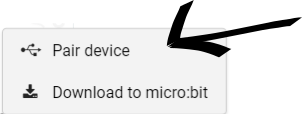
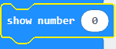
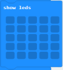
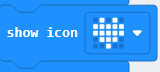
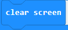

# LED Matrix

## Objective

Learning how to use the LED matrix on the micro:bit which can be used as a screen to output data.

We are going to explore how to use the LED matrix with MakeCode.

 ---
 **NOTE:** You do not need to a micro:bit to complete this tutorial.

---

## Starting MakeCode

1. Open your favourite web browser(we recommend Google Chrome)
2. Within the address bar type[makecode.microbit.org](makecode.microbit.org)
3. Click on New project and give it a meaningful name.

## Pairing your micro:bit using webUSB

1. Click on the 3 dots next to download 

2. Click on Pair device 

3. Select your micro:bit from the next menu it will be named something like this "BBC microbit xxxxxx" and click connect.  This allows us to download our code directly to our micro:bits

## Code Blocks

These are the blocks that we can use to control the LED matrix.

1. **Show Number**
 This does exactly what it says and shows a number on the LED matrix.

2. **Show LEDs**
 This allows you to create your own pattern to display on the LED matrix.

3. **Show Icon**
 This allows us to display preconfigured images on the LED matrix

4. **Show String**
 This does exactly what it says and scrolls a string(what text is called within programming) across the LED matrix.

5. **Show Arrow**
 This displays an arrow or compass direction on the LED matrix

6. **Clear Screen**
 This clears anything that was on the LED Matrix

Let's take a look at these blocks in a bit more detail and see how we can use them.

## show Number

1. Click and drag the forever code block to the left of the screen and drop it within the bin that appears.

2. Click on Basic. Click and drag a show number block to the code area and attach it within the on start block.

3. Click on the 0 of the show number block and type any number you like.

4. Click on Download to flash the code to your micro:bit. Once it is finished you should now see the number you picked scroll across the LED matrix on your micro:bit.

If you don't have a micro:bit don't worry you can use the simulator that is built-in to the MakeCode editor.
