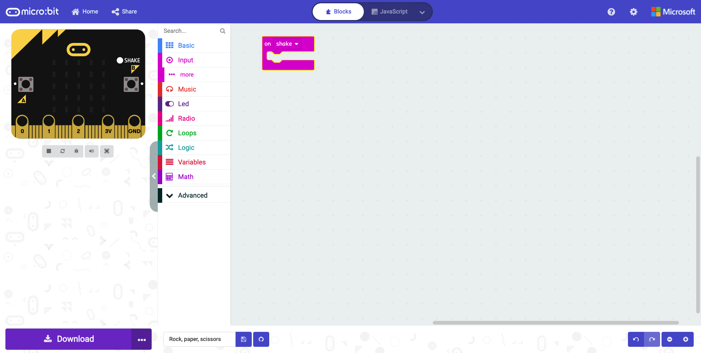
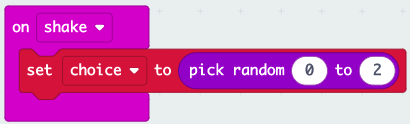
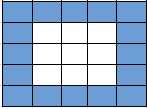
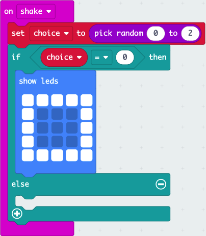
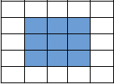
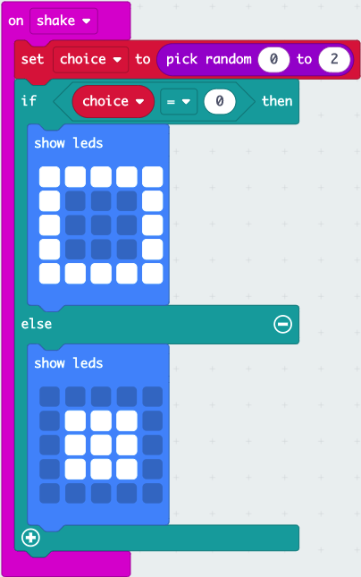
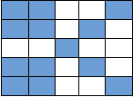
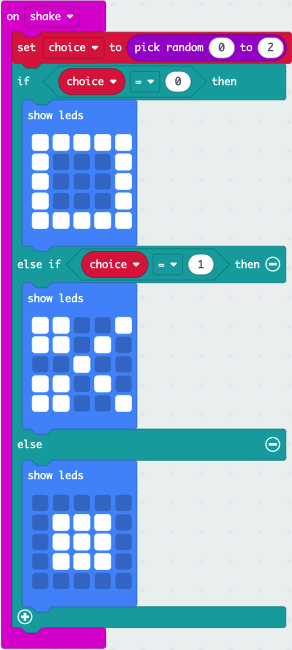

# Rock Paper Scissors

## Overview

We are all familiar with the game Rock Paper Scissors. Let's take a look at how we can code our micro:bits to play.

## What You Will Learn

- [ ] How to create and use a variable
- [ ] How to use the on shake function
- [ ] How to display images/shapes on the LED matrix
- [ ] How to use conditional if/else statemants
- [ ] How to use comparison operators
- [ ] How to randomise choices

## Setting Up

1. Open your favourite browser ( we recommend Google Chrome) or if you are using a mobile phone or tablet open the micro:bit app.
2. Within the address bar of the browser type [makecode.microbit.org](https://makecode.microbit.org/) or on a tablet or phone press create code.
3. Click on new project and give it the name Rock paper scissors.

We are now ready to start coding!

## Getting Started

1. Click and drag the on start block to the left of the screen and drop it on the bin.
2. Click and drag the forever block to the left of the screen and drop it on the bin.
3. Click on Input. Click and drag the on shake block to the code area and drop it.

Your code area should look like this:

## Creating A Variable

### What is a variable

> :pencil2:  Think of a variable as a box that stores information that can be used throughout our program.
> We give variables a descriptive name so we and others can understand what is going on within our program.

1. Click on Variables. Click on make a variable...
2. Type choice and click on OK.

## Set Choice To

1. Click on variables. Click and drag a set choice to 0 block to the code area and attach it within the on shake block.
2. Click on Math. Click and drag pick random 0 to 10 block to the code area and attach it within the 0 of set choice to block.
3. Click on 10 and type 2.

Your code should look like this:

## If Condition

1. Click on Logic. Click and drag an if true then else block to the code area and attach it under set choice to pick random from 0 to 2 block.
2. Click on Logic. Click and drag a 0 = 0 to the code area and attach it within the true of the if then block.
3. Click on Variables. Click and drag choice block and attach it within the first 0 of the if 0 = 0 then block.
4. Click on Basic. Click and drag a show leds block to the code area and attach it within the if choice = 0 then block.
5. Make the following pattern by clicking the squres to represent paper.

Your code will now look like this

## Else Condition

1. Click on Basic. Click and drag a show leds block to the code area and attach it within the else block.
2. Make the following pattern by clicking the quares to represent rock.

Your code should look now like this

## Else If Condition

1. Click on the + sign below else.
2. Click on Logic. Click and drag a 0 = 0 block to the code area and attach it within the blank of else if then block.
3. Click on variables. Click and drag a choice block to the code area and attach it within the first 0 of the else if block.
4. Click on 0 and type 1.
5. Click on Basic. Click and drag a show leds block to the code area and attach it within the else if choice = 1 then block.
6. Create the following pattern to represent scissors.

## Completed Code

We have now finished coding rock paper scissors the next step is to download our code to the miro:bit.

## Downloading the Code

1. Click on the 3 dots next to Download.
2. Click on pair device a pop-up will come on screen to hsow you how to connect the micro:bit to the computer. Click on pair device again.
3. Click on BBC micro:bit xxxx and click connect.
4. Click Download.

You have now successfully coded a micro:bit to play raock paper scissors.

Find a partner and start playing.