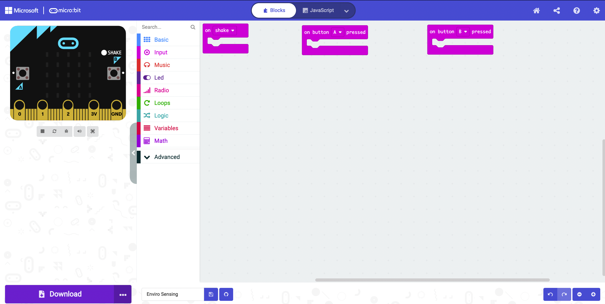
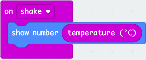
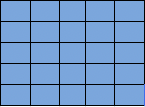
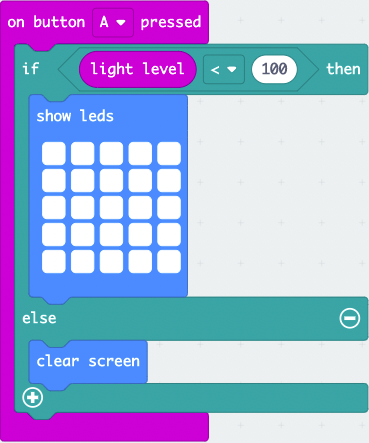
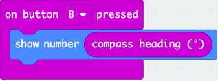
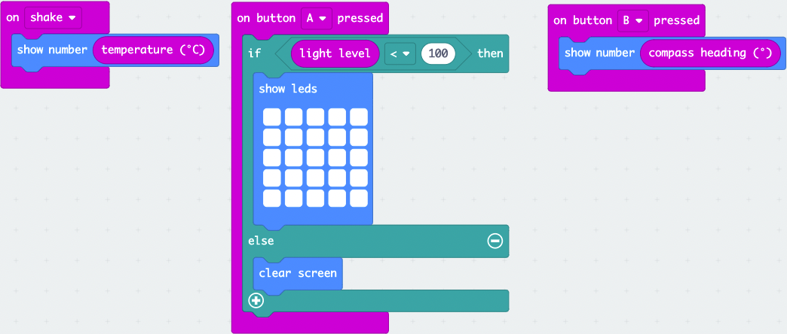

# Sensing Your Environment

We are going to explore our environment by using the temperature sensor, light sensor and compass on the micro:bit.

## What You Will Learn

- [ ] How to use the on shake function
- [ ] How to display a number on the LED matrix
- [ ] How to use the temperature sensor
- [ ] How to use the button function
- [ ] How to use the if/else conditions
- [ ] How to use comparison operators
- [ ] How to display patterns on the LED matrix
- [ ] How to clear the LED matrix
- [ ] How to use the compass

## Setting Up

1. Open your favourite browser ( we recommend Google Chrome) or if you are using a mobile phone or tablet open the micro:bit app.
2. Within the address bar of the browser type [makecode.microbit.org](https://makecode.microbit.org/) or on a tablet or phone press create code.
3. Click on new project and give it the name Enviro Sensing.

We are now ready to start coding!

## Getting Started

1. Click and drag the on start block to the left of the screen and drop it on the bin.
2. Click and drag the forever block to the left of the screen and drop it on the bin.
3. Click on Input. Click and drag the on shake block to the code area and drop it.
4. Click on Input. Click and drag a on button A pressed block to the code area and drop it.
5. Right click on the button A pressed block and click duplicate.
6. On the duplicated block click the little arrow next to A and click on B.

Your code area will now look like this:

## Temperature Sensing

1. Click on Basic. Click and drag a show numbers block to the code area and attach it within the on shake block.
2. Click on Input. Click and drag a temperature block to the code area and attach it within the 0 of show number.

We are now able to sense what the temperature is around us.

## Light Sensing

1. Click on Logic. Click and drag an if/else block to the code area and attach it within on button A pressed.
2. Click on Logic. Click and drag a 0 < 0 block to the code area and attach it within the true of the if then block.
3. Click on Input. Click and drag the light level block to the code area and attach it within the first 0 of the if 0 < 0 then block.
4. Click on the 0 and type 100 and press enter.
5. Click on Basic. Click and drag a show leds block to the code area and attach it within the if light  level < 100 then block.
6. Click on the squares to make the following pattern.

7. Click on Basic. Click and drag a clear screen block to the code area and attach it within the else block.

We can now sense the level of the room we are in.

## Compass Sensing

1. Click on Basic. Click and drag a show number block to the code area and attach it within the on button B pressed.
2. Click on Input. Click and drag the compass heading block to the code area and attach it within the 0 of show number.

We have now coded the compass sensor.

We are now ready to download the code to our micro:bit so we can go out and sense our environment.

## Downloading the Code

1. Click on the 3 dots next to Download.
2. Click on pair device a pop-up will come on screen to how you how to connect the micro:bit to the computer. Click on pair device again.
3. Click on BBC micro:bit xxxx and click connect.
4. Click Download.

You have successfully downloaded the code to your micro:bit. You can now attach a battery pack and go out and sense the environment around you.
